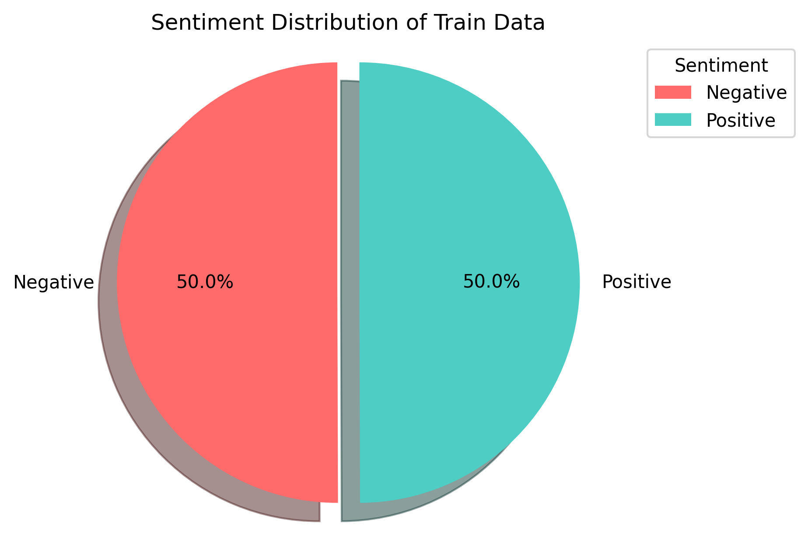
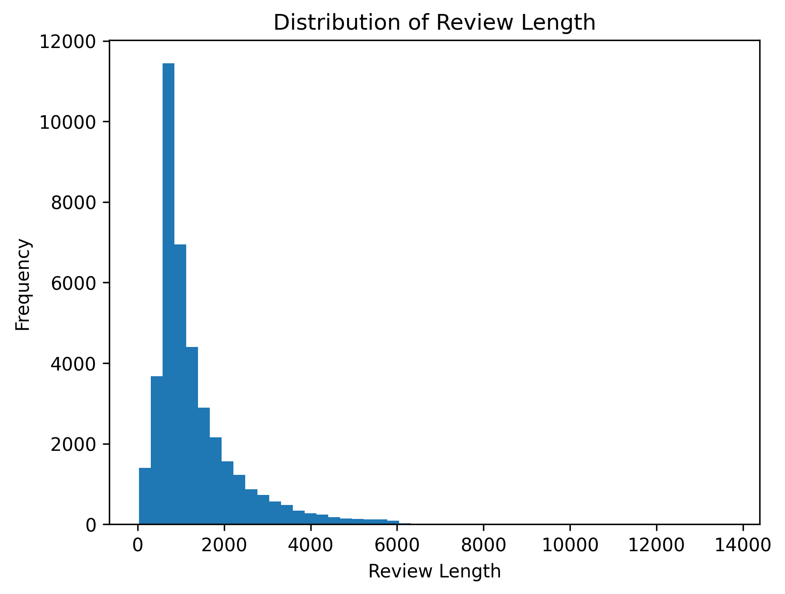
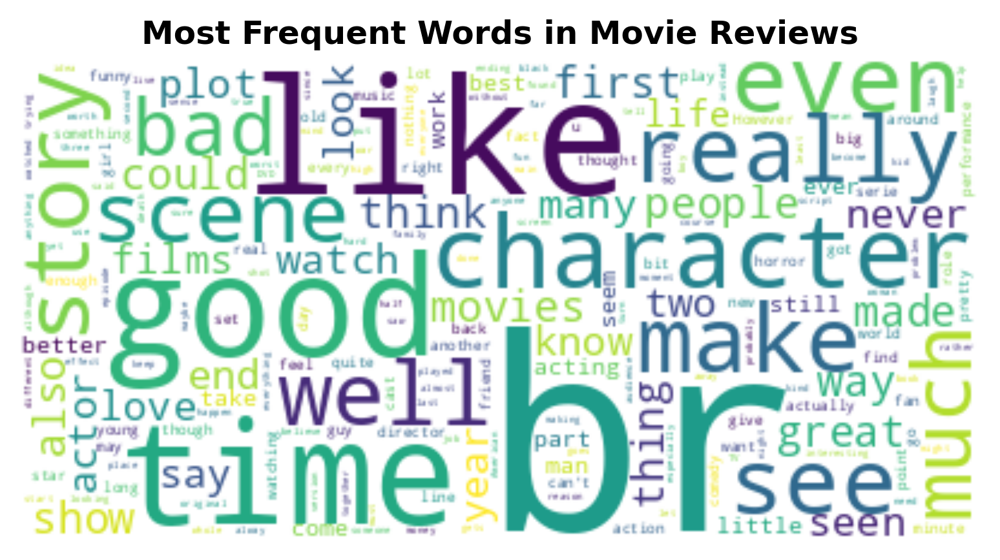

# Sentiment_Analysis_IMDB_Movie_Reviews
## 📊 Project Overview
Machine learning pipeline for classifying movie review sentiments. Compares multiple models and selects Logistic Regression for its optimal balance of accuracy and interpretability.

## 📂 Dataset
**Source**: [IMDB dataset (Sentiment analysis) in CSV format. Kaggle](https://www.kaggle.com/datasets/columbine/imdb-dataset-sentiment-analysis-in-csv-format/data)

**Total Reviews in Trian Data**: 39723

**Total Reviews in Test Data**: 4995

## 🔍 Exploratory Data Analysis (EDA)
### 1. Sentiment Distribution
  
*Distribution of labels in training set*

### 2. Review Length Analysis
  
*Distribution of word counts per review (before preprocessing)*

### 3. Key Terms Visualization
  
*Most frequent words*

## ⚙️ Technical Approach

### Preprocessing Steps
1. Tokenizing
2. Lowercasing
3. Removing non-alphanumeric words and stopwords
4. Lemmatizing
5. Handling Negations
6. TF-IDF vectorization (max_features=5000, ngram_range=(1,2))

## 📈 Model Comparison Results

| Model               | CV Accuracy | Training Time |
|---------------------|-------------|---------------|
| *Logistic Regression* | *88.6%*     | *4s*       |
| Random Forest       | 84.7%        | 13m            |
| XGBoost             | 85.4%        | 13m            |
| Naive Bayes         | 85.8%        | 0s             |
| LightGBM            | 86.1%        | 4m             |

## 🏆 Final Model Performance
Logistic Regression was prioritized for tuning due to its **2-4% higher accuracy** compared to other models, along with **faster training times, interpretability, and robustness to small datasets**. These advantages made it a reliable choice for efficient optimization.

Tuned Logistic Regression
```python
best_parameters: {
    'C': 1,
    'l1_ratio': 0.3,
    'penalty': 'elasticnet', 
    'solver': 'saga'
} 
```
### Test Set Evaluation

#### Performance Metrics
| Metric       | Score |
|--------------|-------|
| Accuracy     | 88.9%     | 
| Precision    | 88.3%     |                 
| Recall       | 89.7%     |                 
| F1-Score     | 89%     |                

#### Confusion Matrix
| Actual \ Predicted | Negative | Positive |
|--------------------|----------|----------|
| **Negative**       |   2197       | 298         |
| **Positive**       |   257       |  2248        |

